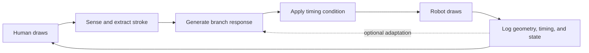

# Architecture

## Intended interaction loop



The loop separates sensing, geometry generation, timing, execution, and logging
so the experimental manipulation is not hidden inside robot-control code.

## System boundaries

| Component | Responsibility | Current status |
| --- | --- | --- |
| Human input | Physical pen stroke on a fixed surface | Planned |
| Camera sensing | Position and drawing registration | Planned |
| Optional pen sensing | Contact, pressure, movement/orientation | Optional |
| Stroke extraction | Start, end, direction, length, velocity, timestamps | Planned |
| Growth generator | Stroke input to bounded branch trajectory | Planned |
| Timing controller | Baseline, fixed delay, or jitter | Planned |
| Drawing primitives | Bounded line, curve, and Y-branch strokes | Implemented in mock; hardware calibration pending |
| Robot controller | Plan and execute myCobot trajectories | Implemented foundation |
| Robot telemetry | Planned and actual motion evidence | Partial foundation |
| Experiment state machine | Trial sequencing and failure states | Planned |
| Event logger | Synchronized machine-readable events | Planned |

## Current repository layout

- `drawing_robot/` — active robot-control package.
- `drawing_robot/drawing.py` — bounded drawing geometry and execution layer;
  public positions use robot-frame centimetres.
- `scripts/` — current executable examples and shape-drawing scripts.
- `future/` — parked drawing-layer code that must be reintegrated and verified;
  it is reference material, not currently runnable production code.
- `docs/` — research, safety, architecture, and data documentation.
- `Objectives.md` — original Milestone 1 objective statement.

## Coordinate and timing boundaries

- The public `Arm` API uses centimetres and degrees.
- Internal kinematics use millimetres and degrees.
- Drawing-surface coordinates require a calibrated transform to robot base
  coordinates; its method and measured error are `TBD`.
- All event records should use a monotonic clock for durations and a UTC wall
  clock for session alignment.
- Intended delay and observed end-to-end latency are separate variables.

## Planned runtime states

```text
IDLE -> READY -> HUMAN_DRAWING -> PROCESSING -> WAITING -> ROBOT_DRAWING
  ^                                                        |
  +---------------- COMPLETE / NEXT_TURN ------------------+

Any state -> SAFE_STOP -> RECOVERY -> IDLE
```

The state machine must reject robot motion when calibration, workspace, or
safety preconditions are not satisfied.
