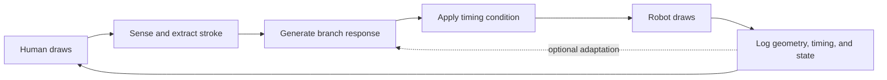

# Architecture

## Intended interaction loop



The loop separates sensing, geometry generation, timing, execution, and logging
so the experimental manipulation is not hidden inside robot-control code.

## System boundaries

| Component | Responsibility | Current status |
| --- | --- | --- |
| Human input | Physical pen stroke on a fixed surface | Planned |
| Camera sensing | Position and drawing registration | Planned |
| Optional pen sensing | Contact, pressure, movement/orientation | Optional |
| Stroke extraction | Start, end, direction, length, velocity, timestamps | Planned |
| Growth generator | Stroke input to bounded branch trajectory | Offline v1 implemented |
| Timing controller | Baseline, fixed delay, or seeded bounded jitter | Offline v1 implemented; study parameters TBD |
| Drawing primitives | Bounded line, curve, and Y-branch strokes | Implemented in mock; hardware calibration pending |
| Robot controller | Plan and execute myCobot trajectories | Single-owner service foundation implemented |
| Robot telemetry | Planned and actual motion evidence | Prioritized service scheduler implemented; hardware revalidation pending |
| Experiment state machine | Trial sequencing and failure states | Offline Case-A turn implemented |
| Event logger | Synchronized machine-readable events | Shared envelope implemented; runner migration incremental |

## Current repository layout

- `drawing_robot/` — active robot-control package.
- `drawing_robot/robot/io.py` — the only module allowed to construct
  `MyCobot280`; it also claims an exclusive process lock for the serial device.
- `drawing_robot/robot/service.py` — prioritized STOP, motion and telemetry
  scheduler plus the single published `RobotState`.
- `drawing_robot/motion/executor.py` — timing boundary between an offline plan
  and the joint waypoints actually submitted to the robot service.
- `drawing_robot/runlog.py` — shared versioned run envelope and event model.
- `drawing_robot/experiment/` — hardware-free stroke representation, growth
  mapping, timing conditions and Case-A trial state machine.
- `drawing_robot/drawing.py` — bounded drawing geometry and execution layer;
  public positions use robot-frame centimetres.
- `scripts/` — current executable examples and shape-drawing scripts.
- `future/` — parked drawing-layer code that must be reintegrated and verified;
  it is reference material, not currently runnable production code.
- `docs/` — research, safety, architecture, and data documentation.
- `Objectives.md` — original Milestone 1 objective statement.

## Coordinate and timing boundaries

- The public `Arm` API uses centimetres and degrees.
- Internal kinematics use millimetres and degrees.
- Drawing-surface coordinates require a calibrated transform to robot base
  coordinates; its method and measured error are `TBD`.
- All event records should use a monotonic clock for durations and a UTC wall
  clock for session alignment.
- Intended delay and observed end-to-end latency are separate variables.

## Runtime ownership

```text
scripts / dashboard / experiment
              |
        RobotService
        |    |     |
      state safety scheduler
              |
            RobotIO
              |
       MyCobot280 / UART
```

The dashboard subscribes to the state published by `RobotService`; it does not
construct a pymycobot backend. An operating-system device lock prevents a
second process from opening the same UART. Motion is DISARMED by default and
requires an explicit local preflight. `stop_motion()` and
`disable_torque(locally_supported=True)` are intentionally different actions.

## Runtime states

```text
DISCONNECTED -> INITIALIZING -> READY -> EXECUTING -> READY
                                  |          |
                                  |          +-> STOPPING -> FAULT
                                  +-> PARKING -> PARKED

FAULT -> manual inspection -> explicitly armed recovery or supported shutdown
```

The state machine must reject robot motion when calibration, workspace, or
safety preconditions are not satisfied.
