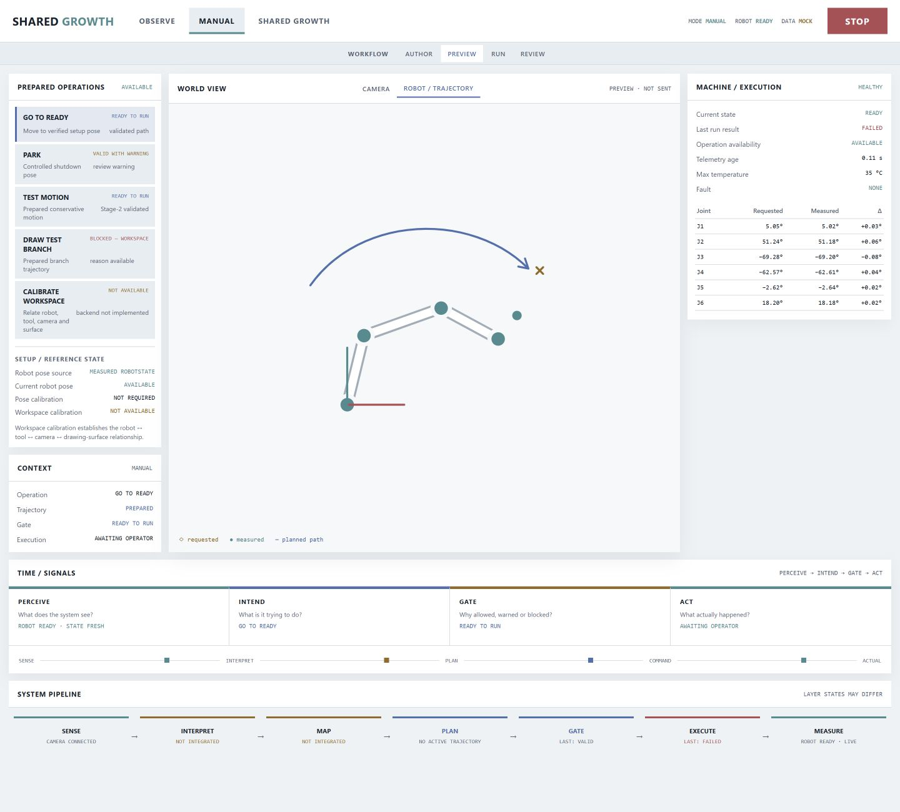

# Robot Interaction Workstation UI prototype

Static interaction-design prototype for the Shared Growth cockpit.



## Boundaries

- Frontend only: HTML, CSS, JavaScript and a local SVG asset.
- All displayed runtime values are explicit mock data.
- No network requests.
- No `pymycobot`, UART, `RobotIO`, FK, validator or executor implementation.
- Buttons demonstrate UI state transitions only and never command a robot.
- The existing Python M1 cockpit and validated execution core remain authoritative.

## Run locally

Open `index.html` in a browser, or serve this directory with any static file
server.

## Interaction model

Operating modes:

```text
OBSERVE | MANUAL | SHARED GROWTH
```

Workflow context:

```text
AUTHOR | PREVIEW | RUN | REVIEW
```

Primary explanatory chain:

```text
PERCEIVE → INTEND → GATE → ACT
```

`MANUAL` invokes prepared operations rather than exposing raw joint or Cartesian
jog controls. Technical gate names and semantics must come from the backend
contract when integration begins.

The light visual system uses colour only for stable semantics: cyan for
measured/live state, blue for planned/intended state, amber for requested,
warning or incomplete state, and red for blocked, failed or stop state.

The measured current robot pose is sourced from authoritative `RobotState` and
does not depend on workspace calibration. `CALIBRATE WORKSPACE` is reserved for
establishing or validating the robot/tool/camera/drawing-surface relationship;
the prototype reports it as `NOT AVAILABLE` until a backend contract exists.
